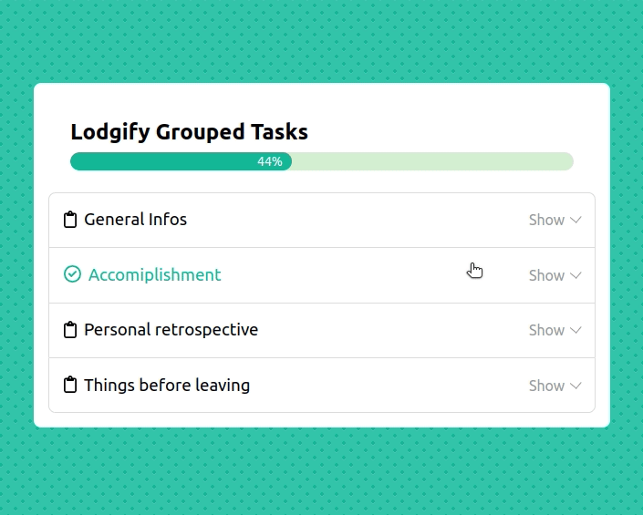

# Readme

This project was bootstrapped with [Create React App](https://github.com/facebook/create-react-app).

## Preview

## Available Scripts

> Make sure you're using node ^14.17.0

In the project directory, you can run:

### `npm start`

Runs the app in the development mode.\
Open [http://localhost:3000](http://localhost:3000) to view it in the browser.

The page will reload if you make edits.\
You will also see any lint errors in the console.

### `npm test`

Launches the test runner in the interactive watch mode.\
See the section about [running tests](https://facebook.github.io/create-react-app/docs/running-tests) for more information.

### `npm run build`

Builds the app for production to the `build` folder.\
It correctly bundles React in production mode and optimizes the build for the best performance.

The build is minified and the filenames include the hashes.\
Your app is ready to be deployed!

See the section about [deployment](https://facebook.github.io/create-react-app/docs/deployment) for more information.

## Tech Stack

The project was done using the following additional third-party libraries:
- `fontawesome`: it provided some icons.
- `react-countup`: to animate the number inside the progress bar.
- `styled-components`: to stylize the app.
- `swr`: for data fetching.
- `use-deep-compare-effect`: to avoid re-rendering when unnecessary.

The development was done with `typescript` for type checking, `prettier` and `eslint` to enforce code style and avoid code smells.

Integration tests were done using `React Testing Library`.